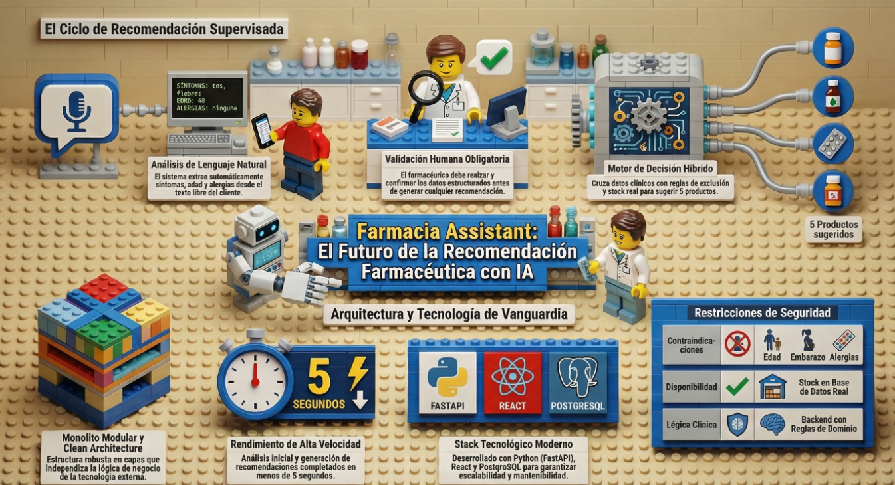

# Farmacia Assistant

## Introducción

**Farmacia Assistant** es una aplicación web que apoya al farmacéutico en su flujo de trabajo frente a la descripción de síntomas de un cliente. La interfaz está desplegada en producción en:

**https://farmacia-assisttant-front-production.up.railway.app/**

---

## Acceso de prueba

Para probar la aplicación desplegada, puedes usar este usuario de demo:

- **Usuario:** `pharmacist`
- **Contraseña:** `pharmacist123`

---

## Finalidad didáctica (Trabajo Fin de Máster)

Este proyecto se enmarca como **TFG del máster** con fines formativos. Los objetivos han sido **aplicar en un caso sustancial las enseñanzas del programa**: diseño de software, arquitectura mantenible, calidad (pruebas, buenas prácticas) y seguridad básica (autenticación, datos sensibles, HTTPS en despliegue), **apoyándose en herramientas de IA** para la producción de código, generación incremental y documentación, sin sustituir el criterio del desarrollador en aruitectura, calidad y seguridad.

Es relevante destacar que **mis conocimientos previos de programación eran muy básicos**; el trabajo constituye un aprendizaje integrado desde cero hasta la construcción de un stack actual (frontend moderno, backend asíncrono, base de datos relacional y despliegue en la nube).

---

## Propósito del proyecto

El sistema permite introducir un **caso clínico en lenguaje natural**, obtener una **estructura clínica editable** (edad, sexo, síntomas, hipótesis, etc.), **validarla manualmente** y, a partir de ello, obtener **recomendaciones de medicamentos** con producto principal, alternativas y explicación, respetando catálogo, stock y reglas de exclusión.

La solución **no sustituye al farmacéutico**: la validación humana del caso es obligatoria antes de generar recomendaciones. El backend concentra toda la lógica de negocio y reglas; el frontend se limita a la experiencia de usuario y a consumir la API.

Para el detalle funcional completo, ver [docs/diseno/DIS-001-diseño.md](docs/diseno/DIS-001-diseño.md).

---

## Arquitectura

El sistema tiene varios componentes pensado para un MVP con despliegue sencillo y baja concurrencia esperada:

- **Frontend (SPA):** React, TypeScript, Vite y Tailwind CSS. Responsable de autenticación en UI, introducción y edición del caso, y visualización de recomendaciones. **No contiene lógica de negocio.**
- **Backend:** Python con **FastAPI**, organizado en **Monolito modular con Clean Architecture** (dominio, aplicación, infraestructura, interfaces HTTP). Expone una **API REST**; orquesta el análisis del caso (incluido apoyo de LLM donde esté configurado), el motor de recomendación y el acceso a datos.
- **Base de datos:** **PostgreSQL** para usuarios, catálogo de medicamentos y stock.
- **Servicios externos:** modelos de lenguaje (LLM) como dependencia intercambiable para extracción estructurada y explicaciones, sin delegar en ellos la lógica normativa del dominio.

El diseño favorece **testabilidad**, **independencia del framework** en el núcleo y **desacoplamiento** de persistencia y proveedores externos. Más detalle en [docs/adr/ADR-001-arquitectura.md](docs/adr/ADR-001-arquitectura.md).

Se ha seguido el patron de desarrollo TDD

### Estructura del repositorio

| Carpeta | Contenido |
|--------|-----------|
| `frontend/` | Aplicación cliente (SPA) |
| `backend/` | API, dominio y casos de uso |
| `docs/` | Diseño funcional, ADRs, planes de videos, manual de usuario |

---

## Documentación y manual de usuario

- Diseño funcional: [docs/diseno/DIS-001-diseño.md](docs/diseno/DIS-001-diseño.md)
- Decisión de arquitectura: [docs/adr/ADR-001-arquitectura.md](docs/adr/ADR-001-arquitectura.md)
- Guía de uso para el usuario final: [docs/manual_usuario.docx](docs/manual_usuario.docx)

---

## Desarrollo local

Convenciones adicionales para contribuidores y agentes: [AGENTS.md](AGENTS.md).

## Licencia y uso

Uso académico y demostrativo salvo que se indique lo contrario. La herramienta no sustituye el juicio clínico ni farmacéutico profesional.

---

## Presentación de vídeo

- [Video del proyecto (YouTube)](https://youtu.be/t28e9aEDIDQ)

